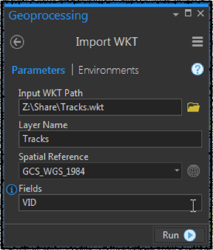
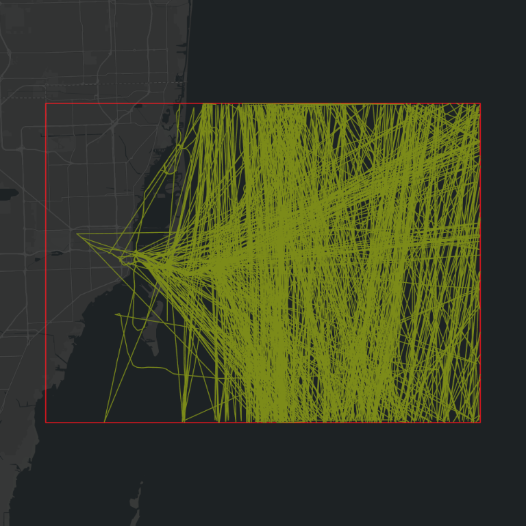
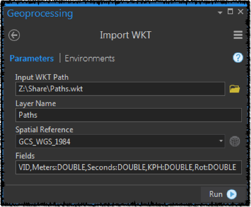
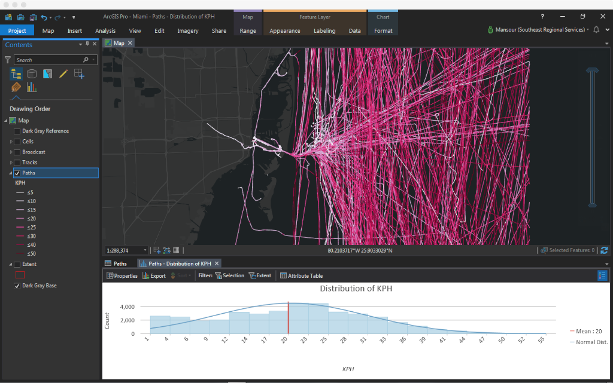
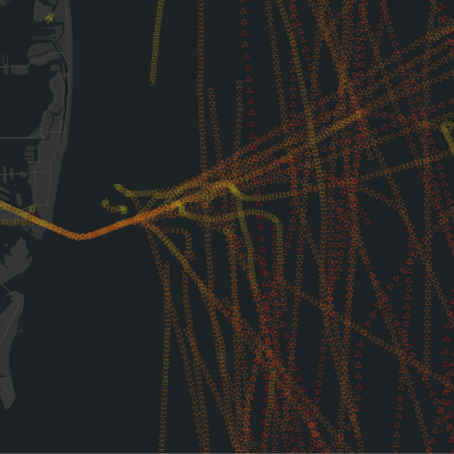

# Spark Pico Path

This project started as a way to detect "patterns of life" from GPS breadcrumbs.  Spatial and temporal patterns emerge beautifully by overlapping massive amount of GPS breadcrumbs.  However, this enormous overlap also introduces noise.  This project is a set of heuristic [Spark](https://spark.apache.org/) based implementations to reveal the signal from the noise, and is divided into three applications:

- Track Assembly
- PicoPath Assembly
- Movement Visualization

## Building The Project

First, make sure to clone https://github.com/mraad/FileGDB.  Build it and publish it using [sbt](https://www.scala-sbt.org/) as follows:

```
git clone https://github.com/mraad/FileGDB.git
cd FileGDB
sbt +publishLocal +publishM2
```

Then, clone and build this project using:

```
git clone https://github.com/mraad/spark-pico-path.git
cd spark-pico-path
sbt assembly
```

## Sample Data

We will use the [AIS](https://en.wikipedia.org/wiki/Automatic_identification_system) broadcasts in the [Miami Port Sample Data](ftp://ftp.coast.noaa.gov/pub/MSP/AIS/AIS.SampleData.zip), that can be downloaded from https://marinecadastre.gov/ais/

## Track Assembly

Typically, acquired GPS breadcrumbs records include a receiver identifier<a href="#note1" id="note1ref"><sup>1</sup></a>. In such that when these records are in a collection, they can be grouped by this identifier to form a track.  Assuming the GPS records are in the table named `targets` with the following mimimalist schema:

```
recv_id:String
gps_ts:Timestamp
gps_lon:Double
gps_lat:Double
```

The track construction from targets can be expressed in SQL-Like as follows:

```sql
select recv_id,assemble(gps_ts,gps_lon,gps_lat) as track
from targets
group by recv_id
```

The `assemble` function can be defined in Spark as a [User Defined Aggregate Function](id="note1" href="#note1ref").  It is implemented in the `TrackAssembler` Scala class.

The full Spark `2.3.0` implementation can be see in the `TrackApp` Scala class, and the following is a sample local execution:

```
spark-submit\
 --master local[*]\
 --conf spark.ui.enabled=false\
 --conf spark.sql.warehouse.dir=/tmp\
 --num-executors 1\
 --executor-memory 16g\
 --class com.esri.TrackApp\
 target/scala-2.11/spark-pico-path-0.1.jar
```

TrackApp assembles targets into tracks by VoyageId and date only (yymmdd), and saves the result as a set of text part files.  Each text part file row consists of a VoyageID and its track on that day in WKT format. The output parts (`/tmp/tracks/part-*`) can be concatinated into a single file, to be imported and viewed in ArcGIS Pro.  The import can be performed using the `ImportWKT.pyt` ArcPy based toolbox.



To produce:



"Patterns" due emerge, but they are interjected by "spiky" tracks due to noisy sequential AIS broadcast data.

So, if we can find these temporal consecutive data points and eliminate them, then smoother pattern will emerge.  This binary temporal sequence of target data is what I label a _PicoPath_.  A PicoPath has a temporal and spatial difference that we can filter upon to remove noise PicoPaths.

## PicoPath Assembly

A PicoPath can be calculated using the [Window](https://databricks.com/blog/2015/07/15/introducing-window-functions-in-spark-sql.html) functions in Spark. The window functions are used in the `PicoPathApp` Scala class, and the following is a sample execution:

```
spark-submit\
 --master local[*]\
 --conf spark.ui.enabled=false\
 --conf spark.sql.warehouse.dir=/tmp\
 --num-executors 1\
 --executor-memory 16g\
 --class com.esri.PicoPathApp\
 target/scala-2.11/spark-pico-path-0.1.jar
```

PicoPathApp assembles targets into PicoPaths, and saves the result as a set of text part files.  Each text part file row consists of:

- AIS MMSI
- PicoPath length in meters
- PicoPath time in seconds
- PicoPath speed in Kilometers per Hour
- PicoPath direction of travel in arithmetic degrees (0 is horizontal, 90 is up)
- PicoPath LineString shape in WKT format.

The output parts (`/tmp/paths/part-*`) can be concatinated into a single file, to be imported and viewed in ArcGIS Pro.  The import can be performed using the `ImportWKT.pyt` ArcPy based toolbox.



To produce something like the following:



To elminiate the noise in the above map, the following query expression was applied:

```
seconds < 180 and kph between 1 and 55
```

## Movement Visualization

PicoPaths can be converted to point locations termed PicoCells.  The PicoCell location is the mid point of the PicoPath with the same attributes (time,distance,velocity,direction).  PicoPoints can now be aggregated by space and time to reveal movement insight.  In the `PicoCellApp`, we are filtering noisy PicoPath by velocity. Then, we are aggretating the derived PicoCells into spatial bins of about 50 meters and temporal bin of 1 hour. This generates a space time cube of 50 meters by 50 meters by 1 hour, and each cube cell hold the accumulated count, average velocity and average travel direction.  The output of the `PicoCellApp` is a CSV file that can be imported as an XY Event layer into ArcGIS Pro.

The following is a sample execution:

```
spark-submit\
 --master local[*]\
 --conf spark.ui.enabled=false\
 --conf spark.sql.warehouse.dir=/tmp\
 --num-executors 1\
 --executor-memory 16g\
 --class com.esri.PicoCellApp\
 target/scala-2.11/spark-pico-path-0.1.jar
```

The following is a sample map after importing the data and is filtered to show the aggregated movements between 3AM and 4AM.



You can see an influx of movement _into_ the harbor due to high tide at that time per [NOAA](https://tidesandcurrents.noaa.gov/waterlevels.html?id=8724580&units=standard&bdate=20090101&edate=20090102&timezone=GMT&datum=MLLW&interval=h&action=)

### References

- https://help.marinetraffic.com/hc/en-us/articles/203990998-What-is-the-significance-of-the-AIS-Navigational-Status-Values-

<a id="note1" href="#note1ref">\[1\]</a>&nbsp;In the sample file geodatabase, the values in the VoyageID or MMSI fields in the Broadcast feature class are used as track identifiers.
